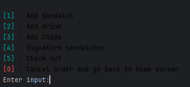
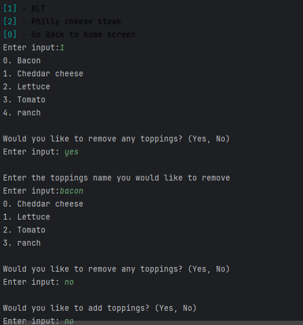
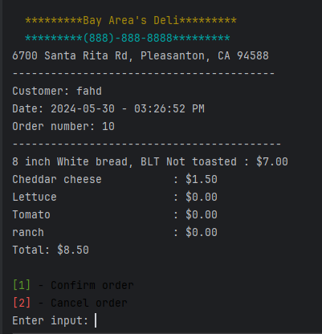

# DELI-cious
I built a deli application that would work on any store or restraunt. The deli application will manage user's order and reciepts. When the user run's this application they will have list of option that will allow them to interact with the application to make they're order. After the order been made the reciept will be saved in the csv file and printed out to the console.

## Base Structure


* Product class will have two childern classes the will inherit from it. The class are sandwish, drink, and chips. The order class will be responseble for taking the order and also containing the array list of products. It will also keep track of the order number, date, and customer's name.


* Topping class will have two childern classes. One class named regularTopping and another named premiumToppings. The regular topping will be included with the order, so the customer won't get charged for regular toppings. However the premium topping class will handle if the topping is meat, cheese, extra meat, or extra cheese and charge the user extra based on the sandwish size.

## New Order List menu


### add sandwich
* Once the user selects add sandwich ("1"). The user will get prompted for the type of bread, meat, cheese, regular topping, sauces, and weither if the sandwich is toasted or not. Once the user enters the meat and cheese toppings, it will charge the user based on weither these topping are extra or not. It will make a object topping for regular and premium based on the topping and then it will get added to sandwich arrayList of toppings.

Getting sandwich

```java
public void addSandWish(Order order) {

        // getting type of bread and sandwich size
        String typeOfBread = ui.getTypeOfBread();
        int sandWishSize = ui.getSandWishSize();

        // getting type of meat from ui
        String[] meat = ui.getSandWishMeat();
        Sandwich sandwish = new Sandwich(meat[0] + "Sandwich", sandWishSize, typeOfBread);
        addMeat(sandwish, meat);

        // getting sandwich Cheese from ui
        String[] cheese =  ui.getSandWishCheese();
        addCheese(sandwish, cheese);

        //getting regular topping from ui
        String[] regularToppings = ui.getRegularTopping();
        addRegularTopping(sandwish,regularToppings);

        //getting sauces for ui
        String[] sauces = ui.getSauces();
        addToppings(sandwish, sauces);

        // checking if the sandwich is toasted from ui
        sandwish.setToasted(ui.isSandwichToasted());

        ArrayList<Toppings> toppings = sandwish.getToppings();

        for (Toppings topping : toppings)
        {
            System.out.printf(" %s - %.2f \n", topping.getType(), topping.getPrice());
        }
    }
```

* Once the user enter's ("2"). The user will prompted for drink size and type. The program will then make a product object type of drink. Then it will be added to the order's products ArrayList.

* Once the user enter's ("3"). To add a chips to they're order. They will be prompted for the chips type then it will be added to the orders product arrayList. 

* Once the user enter's ("4") to checkout. The receipt will be printed out and the user will have the option to cancel the order or confirm it. If The user confrims the receipt will get saved to receipts directory.


## Signature Sandwiches



This part was the hardest part in making this project. Once the user enters ("4"). The program will prompt the user if they want a blt or philly as signature sandwiches. The user will be able to remove toppings and add toppings to the signature sandwiches. I had a signature class the inherts for the sandwich class. The signature class already came with toppings depeings on weither it was a philly cheese steak or a BLT.

This peace of code that I'm really proud was the hardest through out this project. It is responsible for removing the toppings the user selected. At first I was removing the toppings while looping through the array then I realized that was going to bring a lot of issues, so what i did get topping that was what ever the user entered and then removed it outside the loop. Once that was done, the program then prompts the user again if they want to remove any other toppings.


```Java
Sandwich phillyCheeseSteak = new SignatureSandwich("Philly cheese steak", 8, "White");
        String removeToppingOrNot = ui.printSandwichToppings(phillyCheeseSteak.getToppings());
        ArrayList<Toppings> phillyCheeseSteakToppings = phillyCheeseSteak.getToppings();

        while (removeToppingOrNot.equalsIgnoreCase("yes")) {
            // getting the toppings the user wants to remove
            String toppingName = ui.removeToppings();
            Toppings toppingToRemove = null;

            // looping through toppings
            for (Toppings topping : phillyCheeseSteakToppings) {
                // checking if user's topping picked is in the sandwich topping
                if (topping.getType().equalsIgnoreCase(toppingName)) {
                    // removing topping
                    toppingToRemove = topping;
                    break;
                }
            }
            phillyCheeseSteak.removeTopping(toppingToRemove);

            // asking user if they still want to remove more toppings to break out the loop
            removeToppingOrNot = ui.printSandwichToppings(phillyCheeseSteak.getToppings());
        }
```





## Instructions on how to use the application