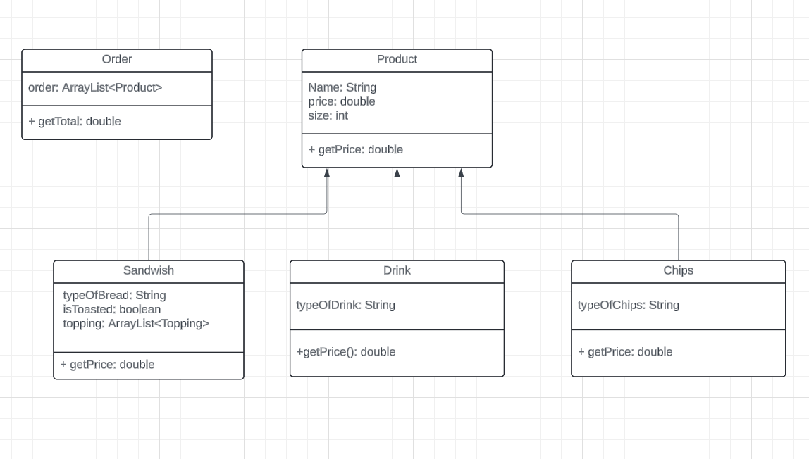

# DELI-cious
I built a deli application that would work on any store or restraunt. The deli application will manage user's order and reciepts. When the user run's this application they will have list of option that will allow them to interact with the application to make they're order. After the order been made the reciept will be saved in the csv file and printed out to the console.

## Base Structure

* Product class will have subclass the will inherit from it. The class are sandwish, drink, and chips. The order class will be responseble for taking the order and also containing the array list of products.